# Saverville

## Overview
Saverville is a decentralized game based on blockchain technology that simulates farming activities using a financial model akin to certificates of deposit (CDs). Players, known as "Farmers," manage virtual farms, growing crops that represent financial investments with defined maturity periods.

## Game Mechanics
- **Purchasing Seeds**: Farmers buy seeds from the Market.
- **Planting Seeds**: Farmers plant their seeds on various plots within their farm.
- **Growth Period**: Seeds mature over time, with a random variance in growth duration.
- **Harvesting**: Harvested plants represent the maturity of the CDs, yielding the initial investment plus interest.
- **Selling Crops**: Farmers can sell their harvested crops at the Market.
- **Withdrawing Funds**: Funds can be withdrawn, similar to withdrawing from a savings account.

## Smart Contracts

### Flowchart

```mermaid
graph TD
    Farm[Farm] -->|1. buy seeds| Market[Market]
    Farm -->|2. plant seeds| FarmPlot[Farm Plot]
    Farm -->|3. harvests crops| FarmPlot
    Farm -->|4. sells crops| Market

    style Market fill:#f90,stroke:#333,stroke-width:2px
    style Farm fill:#303,stroke:#333,stroke-width:2px
    style FarmPlot fill:#cf8,stroke:#333,stroke-width:2px
```

1. Buy Seeds: Farmers purchase seeds from the Market.
2. Plant Seeds: Farmers plant seeds in their farm plots. 
3. Harvest Crops: Farmers harvest mature crops from their farm plots.
4. Sell Crops: Farmers sell harvested crops at the Market.

### Smart Contract Components

### 1. `Market`
Handles all transactions related to buying seeds and selling crops.

#### Methods
- **buySeeds(uint quantity)**
  - Farmers purchase seeds, which are added to their farm.
- **sellCrops(uint plotId, uint amount)**
  - Farmers sell crops from a specific plot for in-game currency.

### 2. `Farm`
Manages the individual farmer's entire farming operation, containing multiple farm plots.

#### Variables
- `address owner` - Owner of the farm.
- `FarmPlot[100] plots` - Array of plots within the farm.
- `uint256 plantableSeeds` - Number of seeds that can be planted.
- `uint256 totalEarnings` - Total earnings in ETH from harvested plants.
- `uint256 totalHarvestedPlants` - Total number of harvested plants.

#### Methods
- **plantSeed(uint256 plotId)**
  - Plants a seed in a specified plot within the farm.
- **waterPlant(uint256 plotId)**
  - Waters the planted seed, setting the harvest time.
- **harvestPlant(uint256 plotId)**
  - Harvests the mature plant from a specified plot.

### 3. `FarmPlot`
Tracks the state of each plot and its maturity.

#### Variables
- `uint state` - State of the plot (0 = free, 1 = seeded, 2 = watered).
- `uint harvestAt` - Timestamp when the plot can be harvested.

#### Methods
- **plant()**
  - Changes the state to seeded.
- **water()**
  - Changes the state to watered and sets the harvest time.
- **harvest()**
  - Changes the state to free after harvest.

### Inheritance and Interfaces

- **VRFConsumerBaseV2**: Used to get random values for the growth period from Chainlink VRF.
- **VRFCoordinatorV2Interface**: Interface for Chainlink VRF Coordinator.

### Events

- **SeedPurchased**
  - `address buyer, uint quantity`
- **SeedPlanted**
  - `address farmAddress, uint plotId`
- **PlantWatered**
  - `address farmAddress, uint plotId, uint harvestAt`
- **PlantHarvested**
  - `address farmAddress, uint plotId`
